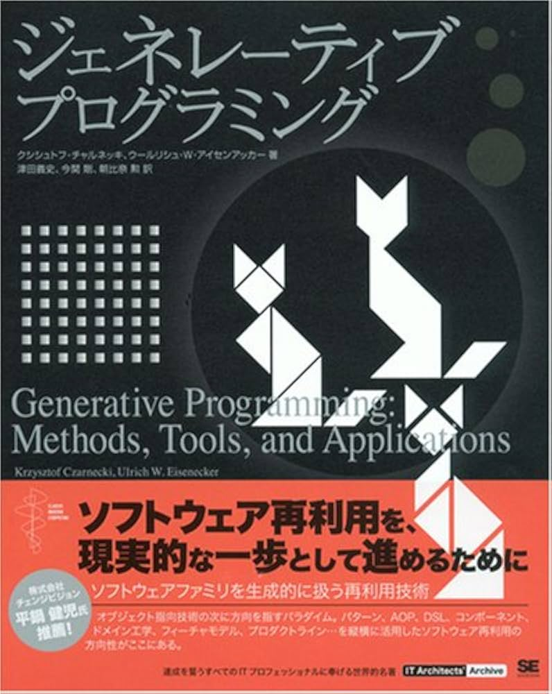

<!-- _class: title -->

# AIがコードを書く時代の
# ジェネレーティブプログラミング

@polidog
設計ナイト 2026

---

# 自己紹介


- @polidog
- パーティーハード株式会社
- Symfony(PHP)が好き

---

<!-- _class: title -->

# AIがコードを書く時代に、
# ソフトウェアをどう設計すればいいのか？

---


# DDDでは動くコードがモデルだった

- エリック・エヴァンスのDDDは「**動くコードこそがモデルである**」と説いた。
- 人間が最終的にコードを書き、システムを作り上げる時代だったからこそ、**動くコード**がモデルであった。
- 人間がコードを書かなくなった今、**動くコードはまだモデルと言えるのか？**

---

# コードがモデルであることの限界

AIが生成したコードを人間が**全て読み解くのは現実的ではない**。

- コード量の爆発的増加
- 生成されたコードの意図が読み取りにくい
- 全体像の把握が困難に

**コードをモデルとすることは、限界を迎えつつある。**

---

<!-- _class: title -->

## ただし、AIがコードを書く時代でも、人の頭の中には**モデルがある**
## 問題は、それが**外に出ていない**こと

---


# SDD（仕様駆動開発）

**SDD（Spec-Driven Development）** という考え方が広まりつつある。

1. 自然言語で**仕様**を書く
2. AIがそれに基づいて**コードを生成**する
3. 生成されたコードを**レビュー・修正**する
4. 変更があれば**仕様を更新**し、再生成する

仕様がモデルとなり、コードはその派生物という位置づけになる。

---

# 自然言語で書かれた仕様はモデルと言えるのか？

自然言語の仕様には、**解釈の幅**がある。

- 人によって読み方が変わる
- AIの解釈も毎回同じとは限らない
- 実行できない、検証できない
- 仕様とコードが乖離しても検知する仕組みがない

**モデルと呼ぶには、曖昧すぎるのではないか。**

---

<!-- _class: title -->

# ジェネレーティブプログラミング

---

# ジェネレーティブプログラミングとは



コードを手で書くのではなく、**コードを生成する仕組みを設計する**という考え方。

2000年にKrzysztof CzarneckiとUlrich Eiseneckerが著書『Generative Programming』で体系化した。

---

# ジェネレーティブプログラミングのプロセス

DEMRAL（Domain Engineering Method for Reusable Algorithmic Libraries）という方法論で、3つのフェーズからなる。

| フェーズ | やること | 成果物 |
|---|---|---|
| **ドメイン分析** | 境界を決め、共通性と可変性を識別 | スコープ定義、フィーチャーモデル、制約 |
| **ドメイン設計** | アーキテクチャやDSL、構成知識を設計 | アーキテクチャ、DSL記法、マッピングルール |
| **ドメイン実装** | コンポーネントやジェネレータを実装 | 生成コード、テスト |

---

# エッセンスを取り入れる

特に以下の2つで、**モデルを検証可能にする**。

## 1. フィーチャーモデル
ドメインの共通性・可変性を**構造化**し、何が固定で何が変わるかを明示する。

## 2. コンフィグレーションDSL
フィーチャーの選択を**宣言的に記述**し、バリデーション可能にする。

自然言語の仕様では曖昧だったモデルが、**構造を持ち、検証できるもの**になる。

---

# フィーチャーモデルとは


ドメインが持つ **フィーチャー（機能的特徴）** をツリー構造で表現したもの。

- どのフィーチャーが**必須**で、どれが**オプション**か
- どのフィーチャーが**択一**で、どれが**共存可能**か
- フィーチャー間にどんな**制約や依存**があるか

<small>図の引用元: https://club-z.zuken.co.jp/hint/20250925_vuca_17.html</small>

---

<style scoped>
pre { font-size: 0.55em; }
p { font-size: 0.8em; }
</style>

# DSLで仕様を記述する

フィーチャーの選択を**宣言的に記述**するためのDSLを定義する。

リストコンテナではYAMLで仕様を記述する：

```yaml
name: IntList
language: go
element_type: int

storage:
  type: array
  initial_capacity: 16
  growth_strategy: doubling

operations:
  - remove
  - insert
  - linear_search
  - iteration:
      direction: forward
```

この記述がAIへの入力となり、生成の**再現性と検証可能性**を高める。

---

# DEMRALを参考にClaude Codeのスキルに

各活動をスラッシュコマンドとして実装し、AIと対話しながら設計資産を作る。

| 活動 | スキル | 成果物 |
|---|---|---|
| ドメインスコーピング | `/domain-scoping` | スコープ定義 |
| フィーチャーモデリング | `/feature-modeling` | フィーチャーモデル、制約 |
| ドメイン設計 | `/domain-design` | アーキテクチャ、コンポーネント、構成の知識 |
| DSL定義 | `/dsl-definition` | DSL記法、サンプル仕様書 |
| 実装 | `/implement` | 生成コード |
| テスト | `/test` | テストコード |

---

# サンプル：リストコンテナの生成

Czarneckiの『Generative Programming』で題材とされたリストコンテナを、AI時代のジェネレーティブプログラミングで再実装したサンプル。

- **フィーチャーモデル** — Storage（Array/LinkedList）、Operations（Sort、Iteration等）の可変性を構造化
- **コンフィグレーションDSL** — YAMLでフィーチャーを選択
- **構成の知識** — フィーチャー選択からコンポーネントへのマッピング + 言語別の導出ルール
- **生成コード** — 同じ仕様からGo・PHPのコードを生成

https://github.com/polidog/gp-example-list

---

# 構成の知識

DSLに書かなくても、構成の知識が**自動的に導出・補完**するものがある。

**言語別コントラクト導出：**
- PHP → `Countable`, `IteratorAggregate` を自動実装
- Go → `iter.Seq[T]` 互換メソッドを自動生成
- Python → `Sized`, `Iterable`, `Container` を自動実装

**組み合わせルール：**
- `Contains` 有効 → `LinearSearch` を自動で有効化
- `Sort` 有効 → ElementTypeの比較可能性を確認
- `LinkedList + Singly + Reverse` → 非効率の警告を付与

---

# 実際に生成できたもの

リストコンテナのサンプルでは、同じ設計資産から**複数言語のコード**を生成できた。

- **Go** — 配列ベース + `iter.Seq[T]` 対応のイテレータ
- **PHP** — `Countable`, `IteratorAggregate` を自動実装

いずれも構成の知識のマッピングルールに基づいて生成され、テストも通過している。

---

# まだ実験段階

- スキルの構成はまだ試行錯誤中
- 実際のプロジェクトに導入して、本当に機能するか試していきたい
- 得た知見は改めて共有したい

---

<!-- _class: title -->
## AIがコードを書く時代の設計手法は、まだ誰も正解を持っていない

--- 

<!-- _class: title -->
## 自分も手探りなので、**一緒に試して、共有しあえたら** 嬉しい。

---

<!-- _class: title -->

# 「動くコード」から 「構造化された仕様」へ

---

<!-- _class: title -->

# ありがとうございました

@polidog
