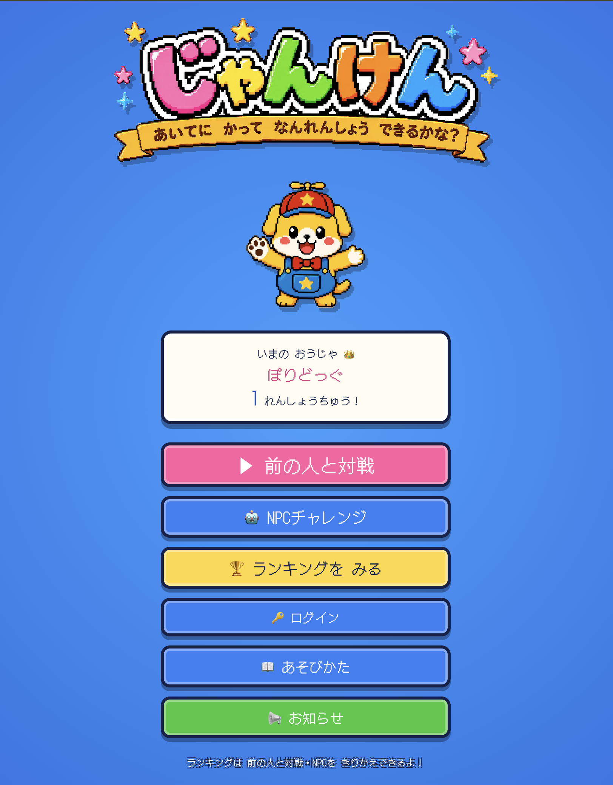

<!-- _class: lead -->
<!-- _footer: '' -->
<!-- _paginate: false -->

# 小さな開発会社がAI時代に生き残るために

## @polidog
## PartyHard Inc.

---

# 会社紹介&自己紹介

- パーティーハード株式会社
  https://ptyhard.co.jp
- 2018年に２人で創業、**今年で9年目**
- webアプリの**受託開発の会社**
- 開発者は大体5人ぐらい在籍
- フルリモートで会社の所在地は新宿だけど、**社長は佐賀**に住んでる
- **休みたい放題**

- **@polidog**
- パーティーハード株式会社
  専務取締役・プログラマ
- 子育て中
- PHP(Symfony)とNext.jsが好き

---

<!-- _class: impact -->
# スポンサー3年目です！！

---

<!-- _class: impact -->
# 38年続く会社を作りたい

---

<!-- _class: center -->

そんな内容のスポンサーLTを去年しました。

https://speakerdeck.com/polidog/2025kichijoujipm

---

<!-- _class: impact -->
# 本当に38年続けられるのか？

---

# Agentic Codingの急速な普及

- Agentic Codingがここ1年で急速に普及した
- AIがコードを書いてくれる時代になった
- じゃあ自分たちは何をする？

---

# めちゃくちゃ不安

- システムが作れること自体の価値は、確実に下がっていく
- 受託開発は、このままでいいのか？

---

<!-- _class: impact -->
# でも、悲観するだけじゃなくて 考えてみた

---

<!-- _class: impact -->
# カレーなんて誰でも作れるのに、 なんでカレー屋があるんだろう？

---

# 誰でも作れても、頼む人はいる

- カレーは誰でも作れる。でも、カレー屋はなくならない
- 自分で作るより **うまい・早い・間違いない** から
- システムも同じ。誰でも作れる時代になっても、**受託開発はなくならないのでは？**

---

# むしろ、受託開発は増えるのでは？

- システムが簡単に作れる時代 = 「作りたい」のハードルが下がる
- 今まで予算やスピードで諦めていた会社も、「うちも作れるかも」と思い始める
- 作りたい人が増えれば、**プロに頼む人も増える**

---

<!-- _class: impact -->
# まあ、未来予測してたところで どうしようもないよね

---

<!-- _class: impact -->
# AIだからこそ、簡単に作れる

---

# だから、いっぱい作る

- AIのおかげで、**思いついたものをすぐ形にできる**時代になった
- どれが当たるかはわからない。でも**徹底的に作れば、きっと何か見えてくる**
- 小さく作って、出して、試す。それを繰り返す
- 受託開発で鍛えた「作る力」が、ここで活きる

---

# 実際に事業を始めてみた

- HTMLテンプレートからPDF・画像を生成するAPIサービス
- https://printgraph.jp/

- 銀行・支店などの金融機関データを取得できるWeb API
- https://ginconnect.jp/

---

# これから始める取り組み — IRUCO（仮）

- パパ・ママを応援するためのアプリ
- 公園でゆるくつながる
- 約束しない。誘わない。ただ「いまここにいる」と伝えるだけ
- 自社プロダクトとして開発中

 

---

# じゃんけんワールド

- 子ども向けのオンラインじゃんけん対戦ゲーム
- 息子と一緒に遊べるものを作りたくて開発
- デザインはChatGPT、実装はClaude Code — **約5時間でリリース**
- https://janken-world.ptyhard.co.jp/

---

# 受託開発と自社事業、両輪で回す

- 受託で培った力が、そのまま事業作りの力になる
- 自社事業で得た知見が、受託の提案力を上げる
- AIで作る速度が上がった分、**考える時間に投資できる**
- これが今の自分たちの「変わり方」

---

<!-- _class: impact -->
# 事業を通じて社会に貢献できる会社へ。

それが38年続けるために必要なことだと思っている。

---

# お仕事募集しています

- 「答えがないもの」を一緒に作りたい方、ぜひお声がけください
- 新規事業の立ち上げ、プロダクト開発、技術的な相談など
- https://ptyhard.co.jp/

---

<!-- _class: lead -->
<!-- _footer: '' -->
<!-- _paginate: false -->

# 来年も、 スポンサーするよ、 きちぴーに

---

<!-- _class: lead -->
<!-- _footer: '' -->
<!-- _paginate: false -->

# ありがとうございました

@polidog
