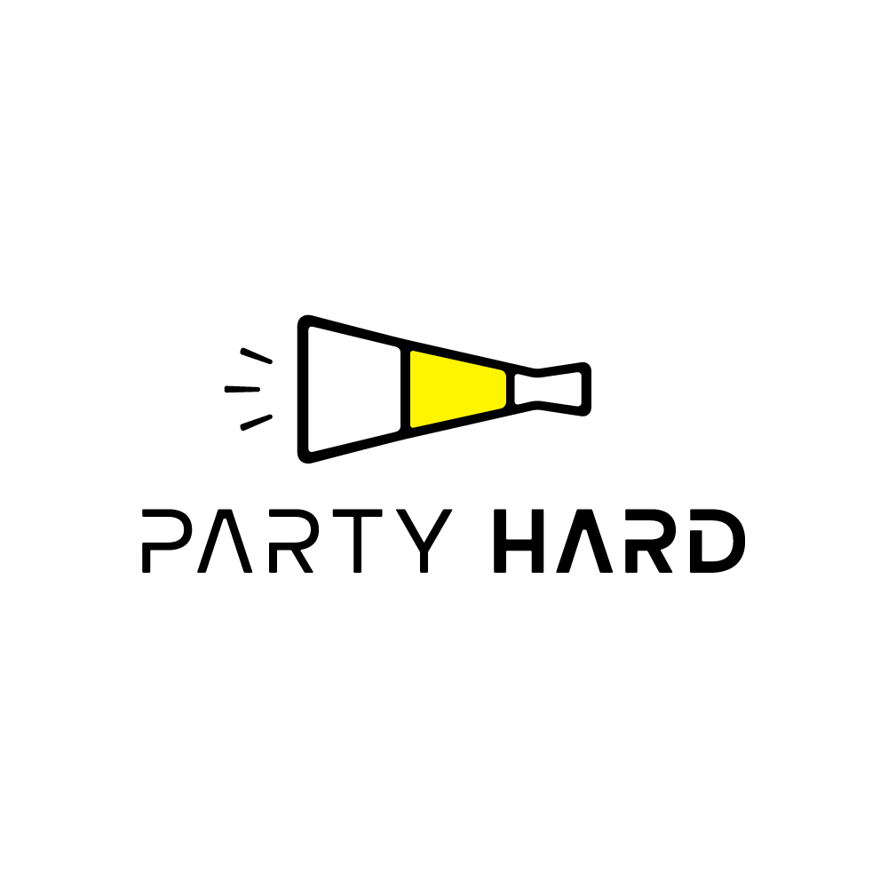
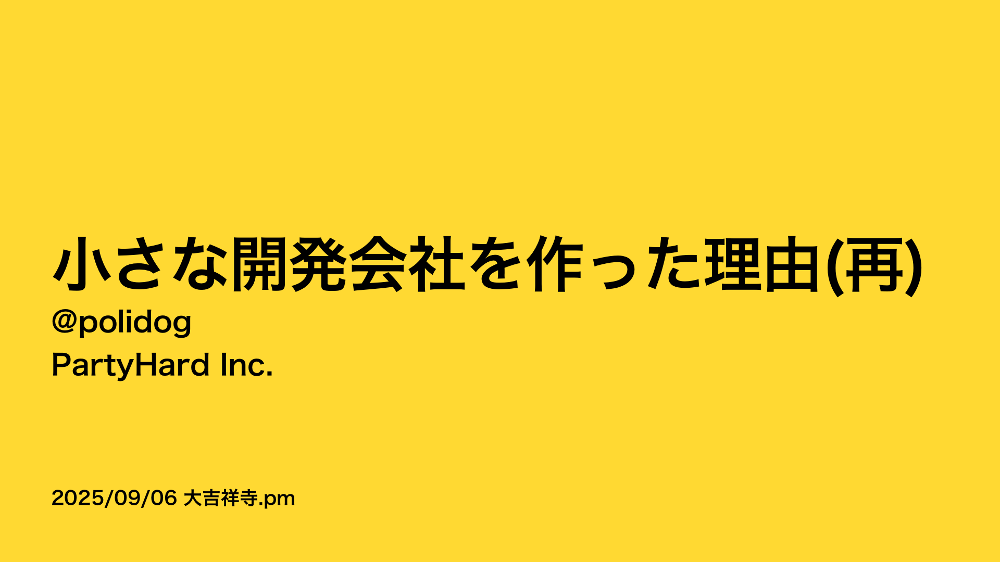
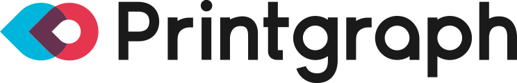
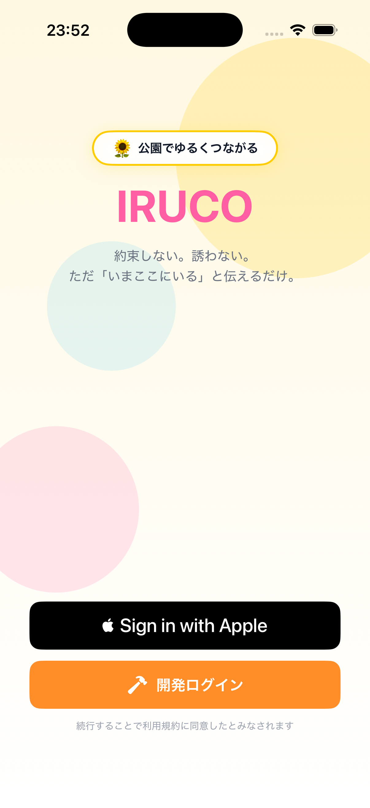
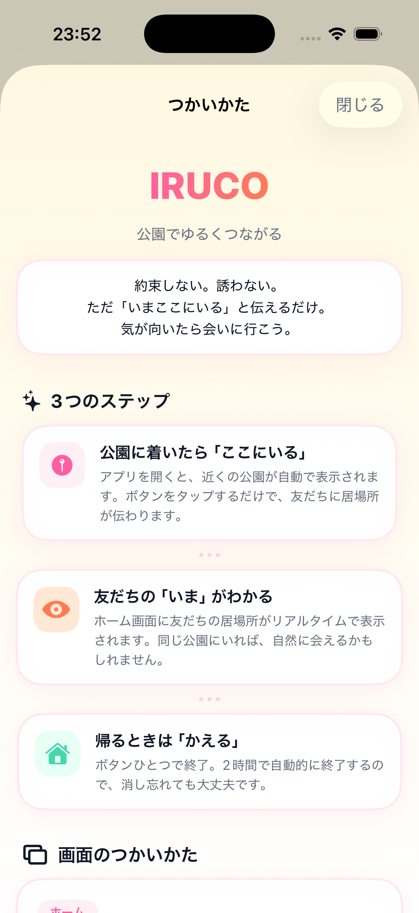

<!-- _class: lead -->
<!-- _footer: '' -->
<!-- _paginate: false -->

# 小さな開発会社がAI時代に生き残るために

## @polidog
## PartyHard Inc.

---

# 会社紹介&自己紹介

- パーティーハード株式会社
  https://ptyhard.co.jp
- 2018年に２人で創業、**今年で9年目**
- webアプリの**受託開発の会社**
- 開発者は大体5人ぐらい在籍
- フルリモートで会社の所在地は新宿だけど、**社長は佐賀**に住んでる
- **休みたい放題**

- **@polidog**
- パーティーハード株式会社
  専務取締役・プログラマ
- 子育て中
- PHP(Symfony)とNext.jsが好き

---

<!-- _class: impact -->
# 38年続く会社を作りたい

---

<!-- _class: center -->

そんな内容のスポンサーLTをを去年しました。

https://speakerdeck.com/polidog/2025kichijoujipm

---

<!-- _class: impact -->
# 本当に38年続けられるのか？

---

# Agentic Codingの急速な普及

- Agentic Codingがここ1年で急速に普及した
- 弊社のような受託開発の会社はいらなくなるのでは？
- 毎日夜も不安で眠れない

---

<!-- _class: impact -->
# 本当にそうなんだろうか？

---

# 簡単に作れるからこそ、開発需要は増える

- AIでシステム開発のコストが下がると、**今まで予算が合わなかった案件が動き出す**
- 「システム化したかったけど高すぎて諦めていた」会社はまだまだたくさんある
- 開発の単価が下がる → **案件の総数は増える**
- 受託開発は「なくなる」のではなく、**形が変わる**

---

<!-- _class: impact -->
# じゃあ自分たちの強みってなんだろう？

---

# 答えのないものを作るのが得意

- 一般的な受託開発は「答えが決まっているもの」をシステムに落とし込む仕事
- 弊社は違う — **答えがまだないものを、作りながら一緒に見つけていく**
- 仕様書がないところから始まるプロジェクトこそ、本領を発揮する
- これはAIにはまだできない、**人間のチームだからこそできること**

---

<!-- _class: impact -->
# これってインターネットが出てきたときと似てない？

---

# AIのインパクトはインターネット登場時と似ている

- インターネットが登場したとき、**なくなった仕事もあれば、生まれた事業のほうが圧倒的に多かった**
- AIも同じで、これから**新しい事業（ビジネス）がたくさん生まれる**はず
- 受託開発が減るかどうかを心配するより、**生まれる側に回りたい**

---

<!-- _class: impact -->
# じゃあ新しい事業にどんどんチャレンジしていこう

---

# すでに始めている取り組み

- HTMLテンプレートからPDF・画像を生成するAPIサービス
- https://printgraph.jp/

- 銀行・支店などの金融機関データを取得できるWeb API
- https://ginconnect.jp/

---

# これから始める取り組み — IRUCO（仮）

- パパ・ママを応援するためのアプリ
- 公園でゆるくつながる
- 約束しない。誘わない。ただ「いまここにいる」と伝えるだけ
- 自社プロダクトとして開発中

 

---

# 受託開発と自社事業、両輪で回す

- 受託開発で培った「答えのないものを作る力」は、**そのまま事業作りの力**
- 受託でお客さんの課題を解く → そこで得た知見が自社事業のヒントになる
- 自社事業で試した技術やノウハウが → 受託の提案力を上げる
- **片方だけでは得られない循環**を、小さな会社だからこそ回せる

---

<!-- _class: impact -->
# 事業を通じて社会に貢献できる会社へ。

それが38年続けるために必要なことなんだろうと思う。

---

# お仕事募集しています

- 「答えがないもの」を一緒に作りたい方、ぜひお声がけください
- 新規事業の立ち上げ、プロダクト開発、技術的な相談など
- https://ptyhard.co.jp/

---

<!-- _class: lead -->
<!-- _footer: '' -->
<!-- _paginate: false -->

# ありがとうございました

@polidog
