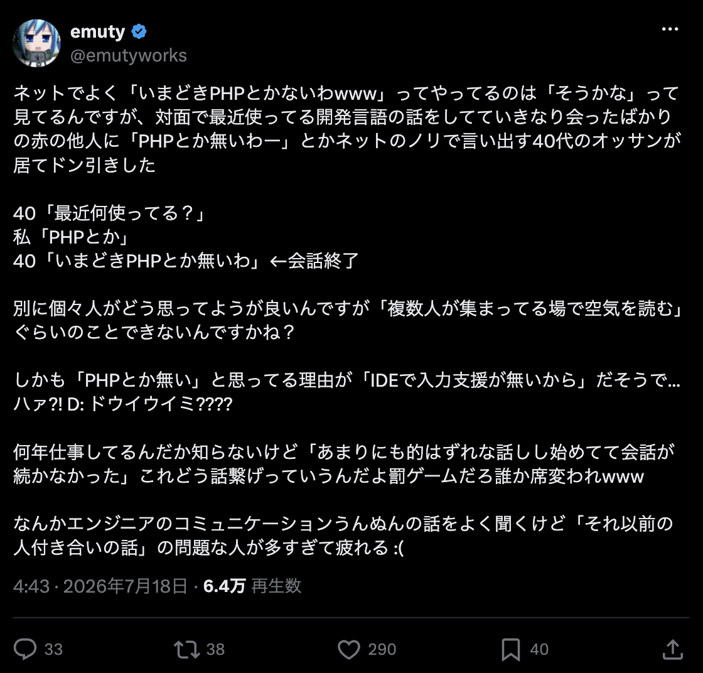

<!-- _class: title -->

# RelayerというPHPのフレームワークを作った

@polidog

Shizuoka Tech #2

---

# 自己紹介


- @polidog
- パーティーハード株式会社という開発会社を経営しています。
- 清水市出身、神奈川県在住
- 5歳と1歳の男の子のパパ
- Symfony(PHP)が好き

---

<!-- _class: title -->
# 去年、React Server Compnentsの話をしました


---

<!-- _class: title -->
https://speakerdeck.com/polidog/react-server-components

---

<!-- _class: title -->
# なぜ今PHPでフレームワークつくるのか？

---

<!-- _class: title -->
# PHPは昔からdisられているし、今もdisらてている


---

<!-- _class: title -->


---

<!-- _class: title -->
# いまでもこういうPHPをdisる発言をみかける


---

<!-- _class: title -->
# だから今日は僕が作ったRelayerというPHPのフレームワークについての良さを語りたいと思います。

--- 

# 今日のアジェンダ


- なぜ今PHPなのか？
- Relayerとはないか？
- DBを支えるtehilim
- 今後の展望について

---

# 今日のゴール

1. **PHPの良さに気づいてもらえること**
2. **Relayerを使ってみたいと思ってもらえること**

--- 

<!-- _class: title -->
# なぜ今PHPなのか?


---

# なぜ今PHPなのか？

- はやい
- シンプル
- やばい

---

# PHPの進化タイムライン

- **2004年 PHP 5.0** — Zend Engine 2、OOPが本格化
- **2014年 PHP 5.6** — PHP5系の最終版（disのイメージはだいたいこの辺で止まってる）
- **2015年 PHP 7.0** — 実行エンジンを全面刷新（phpng）、**一気に約2倍高速化**
- **2020年 PHP 8.0** — **JITコンパイラ**搭載、union型・match式・attributes
- **2021年 PHP 8.1** — enum、readonly、Fiber
- **2024年 PHP 8.4** — property hooks、非対称可視性

### 🎯 **この10年でPHPは書き方も速度も別言語レベルに進化**

---

# 書き方の違い：PHP5時代

```php
<?php
class Money
{
    private $amount;
    private $currency;

    public function __construct($amount, $currency)
    {
        // 型がないので何が渡ってくるかは実行時のお楽しみ
        $this->amount = $amount;
        $this->currency = $currency;
    }

    public function getAmount()
    {
        return $this->amount;
    }
}
```

### 😰 **型なし・getter地獄・実行時エラー頼み**

---

# 書き方の違い：PHP8ならこう書ける

```php
<?php
enum Currency: string
{
    case JPY = 'JPY';
    case USD = 'USD';
}

final class Money
{
    public function __construct(
        public readonly int $amount,
        public readonly Currency $currency,
    ) {}
}

$label = match ($money->currency) {
    Currency::JPY => '円',
    Currency::USD => 'ドル',
};
```

### ✨ **enum + readonly + constructor promotion + match式**

---

# で、どれぐらい速くなったのか？

## 公式発表

- PHP 7.0 は PHP 5.6 の**最大2倍**のスループット、メモリ使用量は**半分**
- PHP 8.0 で JIT コンパイラ搭載、CPUバウンドな処理はさらに高速化

## WordPressでの実測（Cloudways調べ・WP 5.7）

| PHP | 平均レスポンス | 1分間に捌いたリクエスト数 |
|---|---|---|
| 5.6 | 475ms | 1,311 |
| 7.0 | 234ms | 2,682 |
| 8.0 | **164ms** | **3,836** |

---

<!-- _class: title -->
# PHP 5.6 → 8.0 で <span class="impact">約3倍</span> 速くなった

---

<!-- _class: title -->
# 進化したのは本体だけじゃない
## エコシステムも別物になった

---

# 静的解析ツールの進化

- **2015年 Phan** — PHP作者 Rasmus Lerdorf らが開発、PHP 7のASTベース解析
- **2016年 PHPStan** — 「実行せずにバグを見つける」を普及させた立役者
- **2016年 Psalm** — Vimeo製、型カバレッジ計測やtaint解析（セキュリティ）
- **2017年 Rector** — 静的解析を応用した**自動リファクタリング**

---

# PHPStan：実行する前にバグが見つかる

```php
function sendMail(User $user): void { /* ... */ }

function main(?User $user): void {
    sendMail($user); // ← nullかもしれないのに渡してる
}
```

```
 ------ ----------------------------------------------------------
  Line   main.php
 ------ ----------------------------------------------------------
  6      Parameter #1 $user of function sendMail expects User,
         User|null given.
```

- レベル0〜10で厳しさを段階的に上げられる → レガシーにも導入しやすい
- CIで回すのが現代PHPの標準スタイル

---

# PHPDocでgenericsまで書ける

```php
/**
 * @template T
 * @param array<int, T> $items
 * @return T|null
 */
function first(array $items): mixed
{
    return $items[0] ?? null;
}

$user = first($users); // ← PHPStanはUser型だと知っている
```

- `array<int, User>` のような詳細な型指定もチェックされる
- 実行時のPHPは変わらないのに、**開発体験は静的型付け言語並み**

### 🎯 **「IDEで入力支援が無い」どころか、実行前に型チェックまでされる時代**

---

# Rector：バージョンアップすら自動化

```bash
composer require rector/rector --dev
vendor/bin/rector process src --set php80
```

- PHP 5系の古い書き方をPHP 8の書き方へ**自動変換**
- フレームワークのメジャーバージョンアップにも対応
- 「レガシーPHPつらい」→ **機械に書き直させる**時代に

---

<!-- _class: title -->
# そして、実行環境も別物になった

---

# 定番のdis：「PHPはリクエストごとに死ぬ」

## 従来の実行モデル（CGI → mod_php → PHP-FPM）

- リクエストが来るたびに**アプリを初期化して、返したら全部捨てる**
- フレームワークのブートストラップを毎回やり直し
- 「だからPHPは遅い」「常駐できないおもちゃ」と言われてきた

### 🤔 **……それ、もう過去の話です**

---

# 常駐型ランタイムの時代へ

- **Swoole**（2013〜） — 非同期・コルーチンの先駆け
- **RoadRunner**（2018〜） — Go製アプリケーションサーバー
- **Laravel Octane**（2021〜） — Laravel公式の常駐化サポート
- **FrankenPHP**（2023〜） — Caddyベースのモダンランタイム

## worker modeの仕組み

- アプリを**起動したままメモリに常駐**させてリクエストを捌く
- ブートストラップコストがゼロに → FPM比で**数倍のスループット**

---

# FrankenPHP

```bash
# Docker イメージ1枚で本番運用
docker run -v $PWD:/app/public frankenphp/frankenphp
```

- **Caddy（Go製）にPHPを埋め込んだ**モダンランタイム
- **HTTP/2・HTTP/3・Early Hints** を標準サポート、HTTPSも自動
- worker modeでLaravel / Symfonyをそのまま高速化
- アプリを埋め込んだ**単一バイナリ**も作れる → デプロイはファイル1個
- 2024年に**PHP Foundation公式サポート**入り

---

<!-- _class: title -->
# 言語も、開発体験も、実行環境も
## 10年前とは<span class="impact">別物</span>

---

<!-- _class: title -->
# で、そのPHPで僕はフレームワークを作った

---

# 今のPHPフレームワークへの不満

## Controllerで値を集めて、viewに渡す。以上。

- MVCの構造は20年ずっと変わっていない
- Twig / Bladeはしょせんテンプレート言語 → **JSX/TSXの表現力に勝てない**
- コンポーネント指向で書けないから、結局「SPA + API」構成に逃げがち
- つまり**フロントエンドとの親和性が低い**

### 🤔 **去年RSCを布教した身としては、PHPでもあの開発体験が欲しい**

---

# Relayer

## Next.js App Router風の規約で書けるPHPフルスタックフレームワーク

- ルーティング・API・認証・キャッシュ・DBを**ひとつのbootエントリ**にまとめる規約重視の設計
- `src/Pages/` のディレクトリ構成がそのままURLに（`[id]` は動的セグメント）
- **すべてをコンポーネントとして扱う**
- **Server Actions対応**

```bash
composer require polidog/relayer
vendor/bin/relayer init
php -S 127.0.0.1:8000 -t public
```

---

# usePHP：ReactライクにかけるPHP

## 独自拡張子 `.psx`

```php
// src/Pages/page.psx
return fn () => (
    <section className="card">
        <h1>It works</h1>
        <p>これは {date('Y')} 年のページです。</p>
    </section>
);
```

- `{ ... }` でPHP式を埋め込み、PascalCaseタグはコンポーネント
- `className` はReact流（`class` に自動変換）
- コンパイルすると `H::section(...)` のPHPコードに変換される

---

# コンパイルするとこうなる

```php
// コンパイル前（.psx）
return fn () => (
    <section className="card">
        <h1>It works</h1>
        <p>これは {date('Y')} 年のページです。</p>
    </section>
);
```

```php
// コンパイル後
return fn () => H::section(className: 'card', children: [
    H::h1(children: 'It works'),
    H::p(children: ['これは ', date('Y'), ' 年のページです。']),
]);
```

### 🎯 **魔法じゃない。属性は名前付き引数、子要素は `children` のただの関数呼び出し**

---

# JavaScriptがオフでも動く

- usephp.js が**プログレッシブエンハンスメント**で強化する設計
- JSが無い環境では**フォームPOSTにフォールバック**して全機能が動く
- テキストはすべて `htmlspecialchars` で自動エスケープ（XSS安全）

### 🎯 **Reactっぽく書けるけど、実体はサーバーレンダリングのPHP**

---

# React Islands：複雑なUIは本物のReactで

```php
use Polidog\Relayer\React\Island;
return fn () => (
    <section>
        <h1>Dashboard</h1>
        {Island::mount('Chart', ['points' => $data])}
    </section>
);
```

```js
// クライアント側でコンポーネントを登録
window.relayerIslands.register('Chart', (el, props) => {
    createRoot(el).render(<Chart {...props} />);
});
```

- チャートやエディタなど**複雑なUIが必要な場所だけ**Reactをマウントできる
- propsは `data-react-props` にJSONで埋め込まれて渡る

---

# Server Actionsもある

```php
return function (PageContext $ctx, UserRepository $users): Closure {
    $save = $ctx->action('save', function (array $form) use ($users, $ctx): void {
        $users->create($form['name']);
        $ctx->redirect('/users'); // 303 See Other
    });

    return fn () => (
        <form action={$save}>
            <input name="name" />
            <button>save</button>
        </form>
    );
};
```

### 🎯 **フォーム処理をクロージャで直接書く。APIエンドポイント不要、CSRFも自動**

---

# Zodライクなバリデーションが標準装備

```php
use Polidog\Relayer\Validation\Validator;

$schema = Validator::object([
    'email' => Validator::string()->trim()->email(),
    'name'  => Validator::string()->trim()->min(1, '名前は必須です。'),
    'age'   => Validator::int()->min(0)->optional(),
]);

$result = $schema->safeParse($form);
if (!$result->success) {
    $errors = $result->errors; // フィールド単位のエラー
    return; // 同じページを再描画
}
```

### 🎯 **失敗→そのまま再描画、成功→PRG。Server Actionsと相性抜群**

---

# 意外と難しい：アプリをCDNに乗せる

## Cookieを吐いた瞬間、キャッシュされない

- Cloudflareは `Set-Cookie` 付きレスポンスを**問答無用でBYPASS**
- PHPはセッションを開始すると `Cache-Control: no-store` を勝手に注入
- 「1ページでもセッションを使うと全ページキャッシュ不可」になりがち

## Relayerの答え

- セッションは**遅延起動** → 状態を触らないページは `Set-Cookie` を吐かない
- `max-age`（ブラウザ）と `s-maxage`（CDN）を分けて設定できる

---

# Deferコンポーネント

```php
// UserHeader.psx — 本体
return fn (array $props) => (
    <header>こんにちは {$_SESSION['user']['name'] ?? 'ゲスト'} さん</header>
);
// UserHeaderDeferred.psx — ラッパー
use Polidog\UsePhp\Component\Defer;
return fc(
    fn (array $props) => <UserHeader />,
    defer: new Defer(name: 'user-header', cacheControl: 'private, no-store'),
);
```

- SSR時はフォールバックだけ → あとから `/_defer/{name}` で本体を取得
- 本体はCDNキャッシュ、この部分だけ `private, no-store`

### 🎯 **「ログイン名だけ動的」なページも丸ごとCDNに乗せられる**

---

# Deferはクライアント側でもキャッシュできる

## 2段階のキャッシュ

- **L1: インメモリ** — ページ生存期間中は常に有効（フルリロードで消える）
- **L2: localStorage** — リロード・タブをまたいで保持（opt-in）

```php
#[Defer(name: 'feed', localCache: true, localCacheTtl: 60)]
```

- `localCacheTtl`（秒）で有効期限を指定 — HTTPの `Cache-Control` とは独立
- キャッシュ破棄は `DEFER_CACHE_VERSION` のバンプ or `clearDeferCache()`

### 🎯 **CDN（エッジ）+ ブラウザの2層で、動的部分の再取得も最小化できる**

---

<!-- _class: title -->
# DBを支えるTehilim

---

# Tehilim：スキーマファーストなDBツールキット

- 同じく自作の、**Prisma風ワークフロー**のDBツールキット
- 方針は「**データは連想配列、型はPHPDoc**」— ORMのクラスマッピングをしない
- 型安全はPHPStanに委ねる → **静的解析前提の設計**

```bash
composer require polidog/tehilim
vendor/bin/tehilim init                    # スキーマ生成
vendor/bin/tehilim generate                # 型付きクライアント生成
vendor/bin/tehilim migrate dev --name init # マイグレーション実行
```

### 🎯 **スキーマから型付きクライアントを生成して使う**

---

# スキーマ定義：schema.tehilim

```
model User {
  id    Int     @id @default(autoincrement())
  email String  @unique
  name  String?
  posts Post[]
}
model Post {
  id        Int     @id @default(autoincrement())
  title     String
  published Boolean @default(false)
  authorId  Int
  author    User    @relation(fields: [authorId], references: [id])
}
```

### 🎯 **ほぼPrismaのschema。`?` でnull許可、`@relation` でリレーション**

---

# クエリもPrisma風

```php
$found = $db->user->findUnique(['where' => ['email' => 'alice@example.com']]);

$posts = $db->post->findMany([
    'where' => [
        'OR' => [
            ['title' => ['contains' => 'PHP']],
            ['body'  => ['contains' => 'PHP']],
        ],
        'published' => true,
    ],
    'orderBy' => ['createdAt' => 'desc'],
    'take'    => 20,
]);
```

- `findUnique` / `findMany` / `insert` など、`where` 演算子も `select` / `include` もPrisma流

---

# PHPStan連携：連想配列なのに型が見える

```php
$row = $db->user->findUnique([
    'where'  => ['id' => 1],
    'select' => ['email', 'name'],
]);
// PHPStanにはこう見えている:
// array{email: string, name: string|null, id: int}|null

echo $row['email']; // ✅ OK
echo $row['age'];   // ❌ PHPStanがエラーにする
```

- 行データは**プレーンな連想配列**、型情報は `@phpstan-type` で供給
- PHPStan拡張が `select` の内容から**戻り値のarray shapeを絞り込む**

---

# RelayerとTehilimの連携

```php
final class UsersPage extends PageComponent
{
    public function __construct(private readonly TehilimClient $db) {}

    public function render(): Element
    {
        $users = $this->db->user->findMany([
            'include' => ['posts' => ['where' => ['published' => true]]],
        ]);
        return <ul>{array_map(fn($u) => <li>{$u['name']}</li>, $users)}</ul>;
    }
}
```

- 型付きクライアントを**DIで注入**、`include` でリレーションも取得
- dev環境だけプロファイラを注入 → **本番コードに計測機構が載らない**

---

<!-- _class: title -->
# 今後の展望について

---

# これからはAIと一緒に書く時代

## RelayerはAI協働を前提に設計してある

- `RELAYER.md` — ファイル規約・各種契約・「やらないこと」の一覧を1ファイルに集約した**唯一の規約ソース**
- `AGENTS.md` / `CLAUDE.md` は2行のポインタファイル → どのAIツールから入っても同じ規約に辿り着く
- `relayer init` で `.claude/` に **relayer-routingスキル**と**relayer-reviewerサブエージェント**を生成
- 生成コードは relayer-reviewer が**規約準拠かチェック**

### 🎯 **規約重視のフレームワークは、AIが迷わない**

---

<!-- _class: title -->
# で、ロードマップは？

---

<!-- _class: title -->
# <span class="impact">特にないです</span>

### 趣味で作ってるので。楽しいから作る、それだけ

---

# まとめ

- PHPは言語も、開発体験も、実行環境も**10年前とは別物**
- だからPHPでフレームワークを作った — **Relayer**
  - すべてがコンポーネント、Server Actions、Defer + CDNキャッシュ
- DBは**Tehilim** — スキーマファースト + PHPStanで型安全
- 展望は特にない。**楽しいから作る、それだけ**

### 🎯 **disる前に、一度触ってみてほしい**

---

<!-- _class: title -->
# ぜひチュートリアルをやってみてください

### Todoアプリを作りながらRelayerを体験できます
### 📝 https://relayer.polidog.jp/docs/todo-app

---

# 参考リンク

- [PHP 7.0.0 Release Announcement](https://www.php.net/releases/7_0_0.php)
- [WordPress Performance on PHP Versions (Cloudways)](https://www.cloudways.com/blog/wordpress-performance-on-php-versions/)
- [PHP Benchmarks (Kinsta)](https://kinsta.com/blog/php-benchmarks/)
- [PHPStan](https://phpstan.org/)
- [Rector](https://getrector.com/)
- [FrankenPHP](https://frankenphp.dev/)
- [Relayer Documentation](https://relayer.polidog.jp/)
- [PHP Manual: session_cache_limiter](https://www.php.net/manual/en/function.session-cache-limiter.php)
